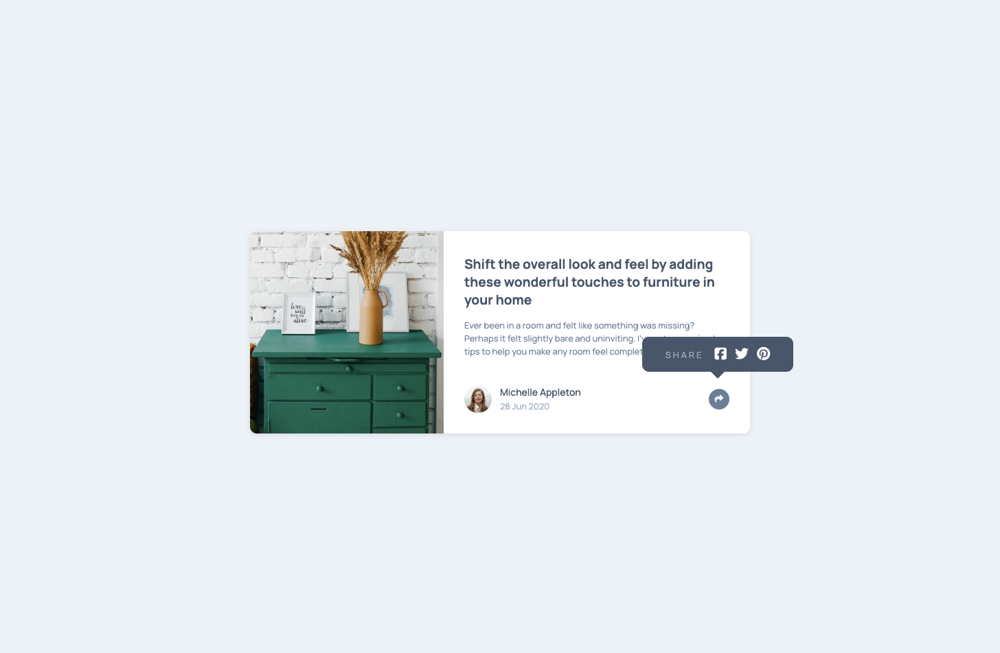

# Frontend Mentor - Article Preview Component Solution

This is my solution to the [Article Preview Component challenge on Frontend Mentor](https://www.frontendmentor.io/challenges/article-preview-component-dYBN_pYFT). The goal of this challenge was to build a responsive card component with share functionality using HTML, CSS, and a bit of JavaScript.

## Table of Contents

- [Overview](#overview)
  - [The Challenge](#the-challenge)
  - [Screenshot](#screenshot)
  - [Links](#links)
- [My Process](#my-process)
  - [Built With](#built-with)
  - [What I Learned](#what-i-learned)
  - [Continued Development](#continued-development)
- [Author](#author)

## Overview

### The Challenge

Users should be able to:

- View the optimal layout for the component depending on their device's screen size
- Click the share icon to reveal social media share options

### Screenshot



### Links

- Solution URL: [https://github.com/oxanamelnyk/article-preview-component](https://github.com/oxanamelnyk/article-preview-component)
- Live Site URL: [https://article-prev-component.vercel.app](https://article-prev-component.vercel.app)

## My Process

### Built With

- Semantic HTML5
- CSS custom properties
- Flexbox
- Responsive design (mobile-first approach)
- Vanilla JavaScript
- Accessibility features (ARIA attributes)

### What I Learned

While working on this project, I improved my skills in:

- Using ARIA attributes for accessibility:
  ```js
  shareBtn.setAttribute(
    "aria-expanded",
    shareBtn.getAttribute("aria-expanded") === "true" ? "false" : "true"
  );
  ```
